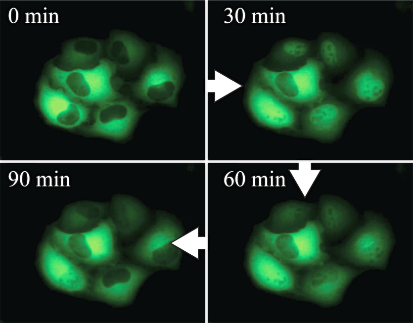

Title:Research interests
Category:Research
Tags: Research
Author: RECLee
Summary: Research

<h3>Under construction</h3>

<h1 class="section-heading">Research vision:</h1>
 

 To decide between irreversible cell fates such as growth, differentiation or death, each cell processes information about its environment through a network of molecular circuits referred to as 'signaling pathways'. These signaling pathways eventually converge on gene transcription, altering the cell's biochemical state. Our research combines principles of systems and synthetic biology with large-scale data to understand how information flows through these signaling pathways. By observing input-output relationships in the same cell using microfluidics, live-cell dynamics and single-molecule microscopy, we aim to decode the signaling ‘language’ and develop mathematical models of information flow with single-cell resolution. Our ultimate goal is to understand how population-level responses emerge from single-cell heterogeneity and to rationally manipulate cell fate decisions in disease. 

 

<h3>A quantitative single-cell perspective of signaling:</h3>

While cells of a clonal population ostensibly express the same components of a signaling network, subtle differences between cells in the abundance or activity of signaling molecules can lead otherwise identical cells to distinct fates. Using real-time microscopy technologies, and genetically modified cells that express fluorescent biosensors, we track the activity of different signaling pathway components over time and associate these with downstream responses in the same cell. The quantitative relationship linking 'input' and 'output' in the same cell can reveal non-intuitive mechanisms of signal transduction that regulate cell fate decisions in response to stimuli or drugs. 
 

 
 

