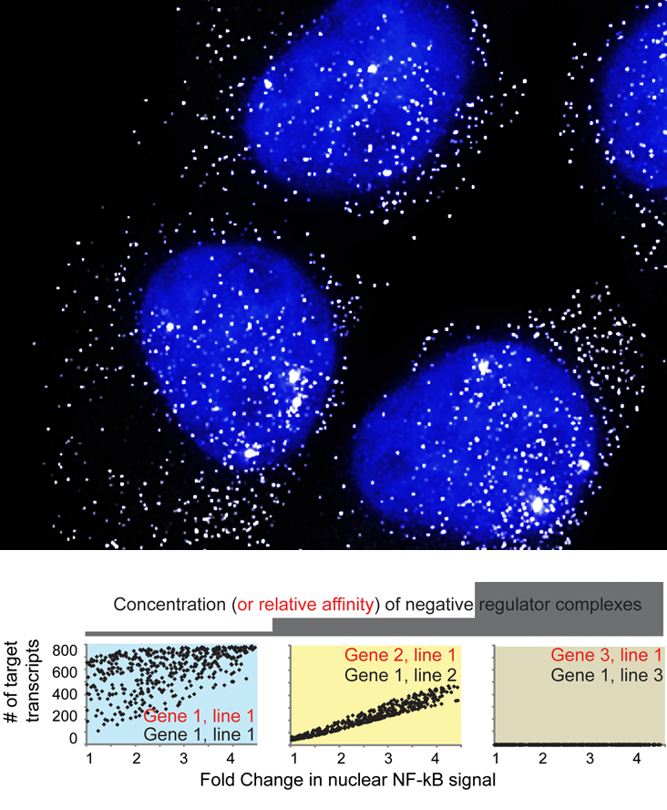

Title:Research interests
Category:Research
Tags: Research
Author: RECLee
Summary: Research

<h3>Under construction</h3>

<h1 class="section-heading">Research vision:</h1>
 

 To decide between irreversible cell fates such as growth, differentiation or death, each cell processes information about its environment through a network of molecular circuits referred to as 'signaling pathways'. The output of these signaling pathways often converge on gene transcription, encoding proteins that alter the cell's biochemical state. Our research combines principles of systems, synthetic and computational biology to understand how information flows through these signaling pathways. By observing input-output relationships in the same cell using microfluidics, live-cell dynamics and single-molecule microscopy, we aim to decode the signaling ‘language’ and develop mathematical models of information flow with single-cell resolution. Our ultimate goal is to understand how population-level responses emerge from single-cell heterogeneity and to rationally manipulate cell fate decisions in disease. 

 

<h3>A quantitative single-cell perspective of signaling:</h3>

While cells of a clonal population ostensibly express the same components of a signaling network, subtle differences between cells in the abundance or activity of signaling molecules can lead otherwise identical cells to distinct fates. Using real-time microscopy technologies, and genetically modified cells that express fluorescent biosensors, we track the activity of different signaling pathway components over time and associate these with downstream responses in the same cell. The quantitative relationship linking 'input' and 'output' in the same cell can reveal non-intuitive mechanisms of signal transduction that regulate cell fate decisions in response to stimuli or drugs. 
 

 
 

 
 
 
 
 

<h3>Transcriptional diversity through competition on promoters:</h3>

When bound to promoter or enhancer regions of DNA, DNA-binding proteins can either activate or repress transcription of nearby genes. During inflammation or in response to a drug, activator and repressor proteins can compete to occupy the same promoter DNA and their interplay determines 'if' and 'how much' the associated gene is transcribed. Depending on the relative abundance of activator and repressor proteins in a cell, and their respective affinity for a promoter DNA sequence, distinct classes of transcription emerge - in the same cell, different genes can be transcribed uniquely even though their transcription is regulated by the same DNA-binding proteins. The NF-kB family of transcription factors is a particularly interesting system to study the complexity that emerges from promoter-level competition because different members of the same family can be activators or repressors, and they have overlapping (yet unique) affinity for different DNA sequences in promoters for 100's of genes. Our overarching goal is to understand how the expression of system-specific competitors 'fine-tune' diverse patterns of transcription, and how variability in biochemical states lead to different patterns of transcription between single cells of the same cell line, and between cell types. By integrating experiments with computational techniques, we aim to quantify and model competition-dependent transcription with single cell resolution.  

